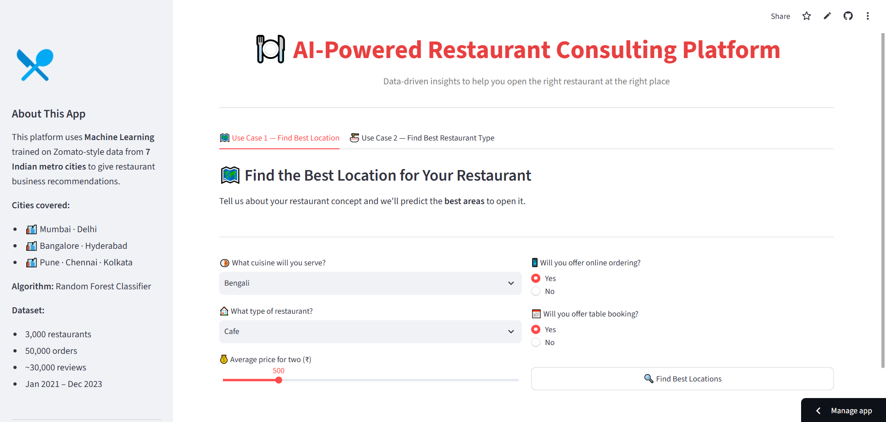
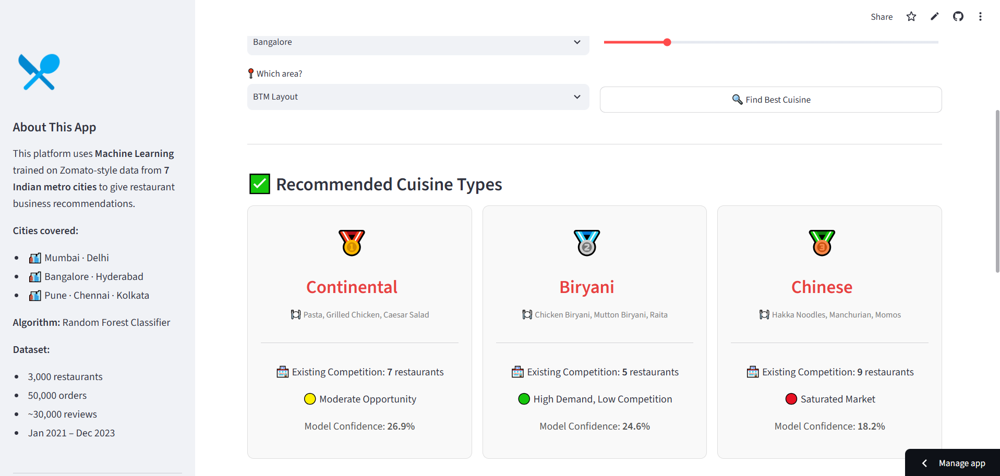

# 🍽️ AI-Powered Restaurant Consulting Platform

An end-to-end **Machine Learning + Streamlit** project that provides data-driven restaurant business recommendations. The platform helps entrepreneurs and restaurant owners decide **where to open a restaurant** and **what cuisine type to serve** using historical restaurant, order, and review data.

## 🚀 Features

### 🗺️ Find the Best Location
Predicts the top recommended areas for opening a restaurant based on cuisine, restaurant type, pricing, and service options.

### 🍜 Find the Best Cuisine
Predicts the most suitable cuisine for a selected city and area using market competition and demand indicators.

---

## 🖼️ Application Screenshots

<p align="center">
  
  
</p>

---

## 📁 Project Structure

```text
AI-Restaurant-Consulting/
│
├── Jupyter Notebook/
│   └── EDA for AI restaurant consulting.ipynb
│
├── data/
│   ├── restaurants.csv
│   ├── customers.csv
│   ├── orders.csv
│   └── reviews.csv
│
├── models/
│   ├── location_model.pkl
│   ├── cuisine_model.pkl
│   ├── label_encoder_area.pkl
│   ├── label_encoder_city.pkl
│   ├── label_encoder_cuisine.pkl
│   ├── label_encoder_type.pkl
│   └── feature_data.pkl
│
├── screenshots/
│   ├── home_page.png
│   ├── location_prediction.png
│   ├── cuisine_prediction.png
│   └── dashboard.png
│
├── app.py
├── model_building.py
├── requirements.txt
└── README.md
```

---

## 📊 Dataset

The project uses four datasets:

- **restaurants.csv** — restaurant information
- **customers.csv** — customer details
- **orders.csv** — order history
- **reviews.csv** — customer reviews

Feature engineering creates business-focused features such as:

- Competition density
- Cuisine popularity score
- Demand-supply gap
- Average order value
- Average rating
- Total orders

---

## 🧠 Machine Learning Models

### Model 1 — Best Location Finder
**Input**

- Cuisine
- Restaurant type
- Price
- Online ordering
- Table booking
- Competition density
- Cuisine popularity
- Demand-supply gap
- Average order value

**Output**

- Recommended restaurant area

### Model 2 — Best Cuisine Finder
**Input**

- City
- Area
- Budget
- Competition density
- Cuisine popularity
- Demand-supply gap
- Average order value

**Output**

- Recommended cuisine type

Both models are trained using **Random Forest Classification** and saved in the `models/` directory.

---

## ⚙️ Installation

### Clone the repository

```bash
git clone https://github.com/your-username/AI-Restaurant-Consulting.git
cd AI-Restaurant-Consulting
```

### Create a virtual environment (optional)

```bash
python -m venv venv
```

### Activate the environment

**Windows**

```bash
venv\\Scripts\\activate
```

**macOS / Linux**

```bash
source venv/bin/activate
```

### Install dependencies

```bash
pip install -r requirements.txt
```

---

## ▶️ Run the Project

### Step 1 — Train the models

```bash
python model_building.py
```

### Step 2 — Launch the Streamlit app

```bash
streamlit run app.py
```

---

## 🛠️ Tech Stack

- Python
- Pandas
- NumPy
- Scikit-learn
- Matplotlib
- Seaborn
- Streamlit
- Joblib
- Jupyter Notebook

---

## 📈 Future Improvements

- Cloud deployment
- Revenue forecasting
- Restaurant success probability scoring
- Interactive map-based location recommendations
- Real-time market data integration

---

## 📄 License

This project is licensed under the **MIT License**. See the `LICENSE` file for details.

---

## 👨‍💻 Author

**Syed Rehan**

If you found this project useful, consider giving the repository a **⭐ on GitHub**.
